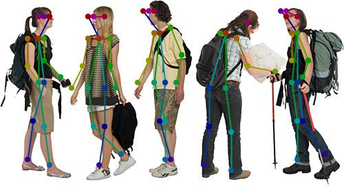

//tag::ref-doc[]
:image-root: https://raw.githubusercontent.com/spring-cloud-stream-app-starters/tensorflow/master/images
= Pose Estimation Service

[cols=2*]
|===
| Real-time, multi-person Pose Estimation service for detecting human figures in images and video. Determines where different body parts
  are located in an image an how are they spatially relate to each other.

  Based on the https://arxiv.org/pdf/1611.08050.pdf[Realtime Multi-Person 2D Pose Estimation using Part Affinity Fields],
   https://github.com/CMU-Perceptual-Computing-Lab/openpose[OpenPose] and https://github.com/ildoonet/tf-pose-estimation[tf-pose-estimation].
| image:./src/test/resources/doc/webcamPoseEstimation.gif[]
|===


The Pose Estimation Service works with a pre-trained https://github.com/ildoonet/tf-pose-estimation[tf-pose-estimation] `TensorFlow` models
for predicting the heatmaps with the parts locations and their affinity. Next as post-processing step the service implements few greedy algorithms
that helps to refine the heatmaps, select the right body parts and group them into poses.

There are two pre-trained models available out of the box:

*  `http://dl.bintray.com/big-data/generic/2018-30-05-mobilenet_thin_graph_opt.pb` (default) - fast but less accurate
*  `http://dl.bintray.com/big-data/generic/2018-05-14-cmu-graph_opt.pb` - accurate but slower

The Pose Estimation Service input is an image or batch of images and the output is a list of Bodies.
The *Body* represents a single body posture found on the image. The Body contains Parts connected by Limbs.
The Limb contains a `PAF` (Part Affiliation Field) confidence score and the `from` and `to` parts it connects.
The *Part* contains the `type` and `coordinates` in the image.


//end::ref-doc[]
== Build

```
$ mvn clean install
```

== Usage

Add the `pose-estimation` dependency to your pom:

```xml
    <parent>
        <groupId>io.mindmodel.services</groupId>
        <artifactId>pose-estimation</artifactId>
        <version>1.0.0-SNAPSHOT</version>
    </parent>
```
(_Use the latest version available_)

Then create a `PoseEstimationService` with one of the pre-trained models and detect the poses input image.

```java
    ResourceLoader resourceLoader = new DefaultResourceLoader();

    try (InputStream is = resourceLoader.getResource("classpath:/images/tourists.jpg").getInputStream()) {

        byte[] inputImage = StreamUtils.copyToByteArray(is);

        Resource model = resourceLoader.getResource("https://dl.bintray.com/big-data/generic/2018-05-14-cmu-graph_opt.pb");
        PoseEstimationService poseEstimationService = new PoseEstimationService(model, true);

        List<Body> bodies = poseEstimationService.detect(inputImage);
    }
```

You can use the `JsonMapperFunction` function to turn the `Body` list into JSON objects:

```java

        String bodiesJson = new JsonMapperFunction().apply(bodies);
```

The output JSON format looks like:

```json
[{ "limbs": [ { "score": 8.4396105, "from": { "type": "lShoulder", "y": 56, "x": 160 }, "to": { "type": "lEar", "y": 24, "x": 152 } },
              { "score": 10.145516, "from": { "type": "neck", "y": 56, "x": 144 }, "to": { "type": "rShoulder", "y": 56, "x": 128 } },
 { "limbs": [ { "score": 7.85779, "from": { "type": "neck", "y": 48, "x": 328 }, "to": { "type": "rHip", "y": 128, "x": 328 } },
              { "score": 6.8949876, "from": { "type": "neck", "y": 48, "x": 328 }, "to": { "type": "lHip", "y": 128, "x": 304 } } ]
...
}]
```

Or the `PoseEstimateImageAugmenter` function to draw the detected body skeletons on top of the input image:

```java
        byte[] augmentedImage = new PoseEstimateImageAugmenter().apply(inputImage, bodies);
        IOUtils.write(augmentedImage, new FileOutputStream("./pose-estimation/target/tourists-augmented.jpg"));
```



